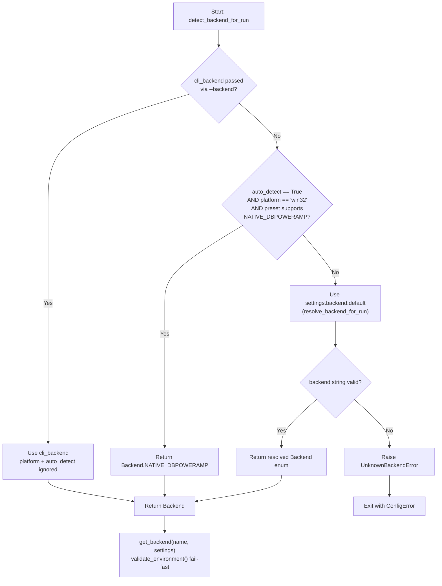
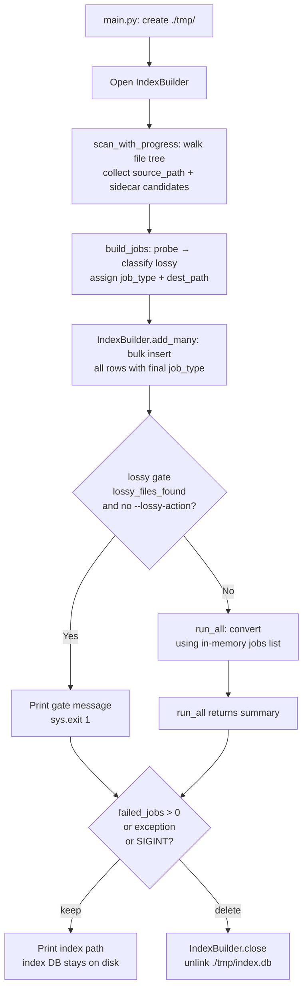

# Windows Auto-Detection + Native dBpoweramp Backend

## Overview

This plan adds two related capabilities to [wrapper-dbpoweramp](wrapper-dbpoweramp):

**(a) Automatic backend detection** — a new `detect_backend_for_run(cli_backend, settings, preset, platform, auto_detect_override=None)` function in [backends/registry.py](backends/registry.py) that chooses the right backend when `--backend` is not passed, with an opt-in/opt-out toggle via `settings.yaml` and CLI.

**(b) A new `NativeDbpowerampBackend`** — a `ConversionBackend` subclass that calls `CoreConverter.exe` directly on Windows (`sys.platform == 'win32'`), bypassing Wine entirely. It reuses the same `coreconverter_path` from `settings.yaml` and mirrors [backends/wine_dbpoweramp.py:136-143](backends/wine_dbpoweramp.py) command structure but with no `wine` prefix, no `winepath` translation, and no `WINEPREFIX` environment variable.

The existing [WineDbpowerampBackend](backends/wine_dbpoweramp.py) and [resolve_backend_for_run](backends/registry.py) are untouched — `detect_backend_for_run` is a higher-level wrapper layered above them.

---

## Phase A — `Backend` enum + `NativeDbpowerampBackend` class

### A.1 — Add `NATIVE_DBPOWERAMP` to the `Backend` enum

**File:** [models/types.py:9-13](models/types.py)

```python
class Backend(str, Enum):
    """Conversion backend: wine_dbpoweramp, native_ffmpeg, or native_dbpoweramp."""

    WINE_DBPOWERAMP = "wine_dbpoweramp"
    NATIVE_FFMPEG = "native_ffmpeg"
    NATIVE_DBPOWERAMP = "native_dbpoweramp"
```

### A.2 — Create `backends/native_dbpoweramp.py`

**File to create:** [backends/native_dbpoweramp.py](backends/native_dbpoweramp.py)

Mirror the structure of [backends/wine_dbpoweramp.py:21-179](backends/wine_dbpoweramp.py) with these specific differences:

| Aspect | `WineDbpowerampBackend` | `NativeDbpowerampBackend` |
|---|---|---|
| Path translation | `to_wine_path()` called on both infile/outfile | No translation — paths passed as-is |
| Command prefix | `[wine_binary, coreconverter_path, ...]` | `[coreconverter_path, ...]` — no wine prefix |
| Environment | `{**os.environ, "WINEPREFIX": wine_prefix_str}` | `os.environ` only — no `WINEPREFIX` |
| Settings block | `settings.backend.wine_dbpoweramp` | `settings.backend.native_dbpoweramp` |
| `validate_environment()` checks | `wine_binary`, `winepath_binary`, `wine_prefix` dir, `wine --version` | `coreconverter_path` file exists on disk |

**Exact `run()` command builder** (contrast with [backends/wine_dbpoweramp.py:136-143](backends/wine_dbpoweramp.py)):

```python
# wine_dbpoweramp.py:136-143 (reference):
cmd = [
    wine_binary, coreconverter_path,
    f"-infile={wine_infile}", f"-outfile={wine_outfile}",
    f"-convert_to={encoder}", *extra_args,
]

# native_dbpoweramp.py (new):
cmd = [
    coreconverter_path,
    f"-infile={str(job.infile)}",
    f"-outfile={str(job.outfile)}",
    f"-convert_to={encoder}",
    *extra_args,
]
```

`validate_environment()` checks `Path(cc_path).is_file()` and raises `BackendError` with an actionable message on failure.

---

## Phase B — Settings schema: `native_dbpoweramp` block + `auto_detect` field

**File:** [config/settings_loader.py](config/settings_loader.py)

1. Add `NativeDbpowerampConfig` dataclass (one field: `coreconverter_path: str`).
2. Add `auto_detect: bool` to `BackendConfig` ([config/settings_loader.py:37-43](config/settings_loader.py)).
3. Update `load_settings()` to parse both new fields. `auto_detect` defaults to `True` if absent.

**File:** [settings.yaml](settings.yaml)

```yaml
backend:
  default: "native_ffmpeg"        # "wine_dbpoweramp" | "native_ffmpeg" | "native_dbpoweramp"
  auto_detect: true               # on Windows, auto-select native_dbpoweramp when preset supports it

  native_dbpoweramp:              # used on Windows native (no Wine)
    coreconverter_path: "C:\\Program Files\\dBpoweramp\\CoreConverter.exe"

  wine_dbpoweramp:
    wine_binary: "wine"
    wine_prefix: "~/.wine-dbpoweramp"
    coreconverter_path: "C:\\Program Files\\dBpoweramp\\CoreConverter.exe"
    winepath_binary: "winepath"

  native_ffmpeg:
    ffmpeg_binary: "ffmpeg"
    flac_binary: "flac"
    lame_binary: "lame"
    opusenc_binary: "opusenc"
```

---

## Phase C — Registry: `detect_backend_for_run` + `get_backend` dispatch

**File:** [backends/registry.py](backends/registry.py)

Add `detect_backend_for_run()` after `resolve_backend_for_run()` ([backends/registry.py:17-34](backends/registry.py)):

```python
def detect_backend_for_run(
    cli_backend: Backend | None,
    settings: Settings,
    preset: PresetConfig,
    platform: str,
    auto_detect_override: bool | None = None,
) -> Backend:
    """Resolution order:
      1. cli_backend if explicitly given (platform and auto_detect ignored).
      2. If auto_detect is True AND platform == 'win32' AND
         preset supports NATIVE_DBPOWERAMP → return NATIVE_DBPOWERAMP.
      3. Else fall back to settings.backend.default (via resolve_backend_for_run).
    """
    if cli_backend is not None:
        return cli_backend

    auto_detect = auto_detect_override if auto_detect_override is not None else settings.backend.auto_detect

    if (
        auto_detect
        and platform == "win32"
        and Backend.NATIVE_DBPOWERAMP in preset.backends
    ):
        return Backend.NATIVE_DBPOWERAMP

    return resolve_backend_for_run(None, settings)
```

Update `get_backend()` ([backends/registry.py:37-69](backends/registry.py)) to add a third branch for `Backend.NATIVE_DBPOWERAMP → NativeDbpowerampBackend(settings)`, and add the import.

---

## Phase D — Preset loader: `native_dbpoweramp` YAML key + presets update

**File:** [config/preset_loader.py:138-141](config/preset_loader.py)

Change:

```python
for backend_key in ("wine_dbpoweramp", "native_ffmpeg"):
```

to:

```python
for backend_key in ("wine_dbpoweramp", "native_ffmpeg", "native_dbpoweramp"):
```

**File:** [presets.yaml](presets.yaml)

Add `native_dbpoweramp` blocks to: `flac-lossless`, `mp3-v0-vbr`, `mp3-320-cbr`, `aac-vbr-high`, `opus-128`. Do **NOT** add to `qaac-cvbr-256` (requires Apple `CoreAudioToolbox.dll` — Windows-only via Wine).

Example (per preset):

```yaml
# flac-lossless
  backends:
    wine_dbpoweramp:
      encoder: "FLAC"
      args: ["-compression-level-5", "-verify"]
    native_ffmpeg:
      tool: "ffmpeg"
      args: ["-c:a", "flac", "-compression_level", "5"]
    native_dbpoweramp:
      encoder: "FLAC"
      args: ["-compression-level-5", "-verify"]
```

---

## Phase E — CLI: `--auto-detect-backend` / `--no-auto-detect-backend` flags

**File:** [cli/args.py](cli/args.py), after the `--backend` argument ([cli/args.py:62-66](cli/args.py))

```python
backend_auto = parser.add_mutually_exclusive_group()
backend_auto.add_argument(
    "--auto-detect-backend",
    action="store_true",
    dest="auto_detect_backend",
    help="Enable auto-detect (default on Windows when auto_detect: true in settings.yaml).",
)
backend_auto.add_argument(
    "--no-auto-detect-backend",
    action="store_false",
    dest="auto_detect_backend",
    help="Disable auto-detect; use settings.yaml default backend.",
)
```

Stores `True`/`False`/`None` for `args.auto_detect_backend`.

---

## Phase F — `main.py`: wire `detect_backend_for_run` + preset compatibility gate

**File:** [main.py:36-42](main.py)

Replace the current resolution with:

```python
import sys  # already imported

cli_backend: Backend | None = None
if args.backend is not None:
    cli_backend = Backend(args.backend)

backend_name = detect_backend_for_run(
    cli_backend=cli_backend,
    settings=settings,
    preset=preset,            # resolved at main.py:31
    platform=sys.platform,
    auto_detect_override=args.auto_detect_backend,
)
backend = get_backend(backend_name, settings)

# Presset compatibility gate (after backend resolution)
if not backend.supports(preset):
    available = ", ".join(b.value for b in preset.backends.keys())
    print(
        f"error: backend '{backend.name().value}' does not support preset '{preset.name}'.\n"
        f"Available backends for this preset: {available}",
        file=sys.stderr,
    )
    sys.exit(1)
```

---

## Phase G — README.md: Windows support + preset table update

**File:** [README.md](README.md)

- Add a "Windows Support" section after Quick Start: explains that on Windows the wrapper auto-selects `native_dbpoweramp` when the preset supports it.
- Update the "Available presets" table to include a `native_dbpoweramp` column.
- Update the "CLI flags" table to add `--auto-detect-backend` and `--no-auto-detect-backend`.

---

## Backend Resolution Decision Flow



---

## Edge Cases

- **E1 — Windows + preset only supports `wine_dbpoweramp`** (e.g. `qaac-cvbr-256`): `Backend.NATIVE_DBPOWERAMP not in preset.backends` → falls through to `settings.backend.default`. If default is also unavailable, `get_backend` raises `BackendError` cleanly.
- **E2 — Windows + `auto_detect: false` + no `--backend`**: Falls through to `settings.backend.default`. The new `backend.supports(preset)` gate in Phase F surfaces a clear "backend does not support preset" error.
- **E3 — `coreconverter_path` missing on Windows**: `NativeDbpowerampBackend.validate_environment()` checks `Path(cc_path).is_file()` → raises `BackendError` with install instructions.
- **E4 — Linux with `--backend native_dbpoweramp`**: `detect_backend_for_run` step 1 (CLI override) returns it; `get_backend` instantiates `NativeDbpowerampBackend`; `validate_environment()` fails because the Windows path doesn't exist on Linux → `BackendError`. Intentional.
- **E5 — `auto_detect: true` on Linux/macOS**: `platform == 'win32'` check is `False` → falls through to `settings.backend.default`. No behavior change.

---

## Phased Task Breakdown (suitable for `Task(appa)` / `Task(aang)` dispatch)

Tasks within a phase are independent and can be parallelized.

### Task A — `Backend` enum + `NativeDbpowerampBackend` class
**Files:** [models/types.py:9-13](models/types.py), create [backends/native_dbpoweramp.py](backends/native_dbpoweramp.py).
**Verify:** `python -c "from models.types import Backend; print(Backend.NATIVE_DBPOWERAMP.value)"` → `"native_dbpoweramp"`.
**Depends on:** none.

### Task B — Settings schema
**Files:** [config/settings_loader.py](config/settings_loader.py), [settings.yaml](settings.yaml).
**Verify:** `load_settings` returns `auto_detect=True` and `native_dbpoweramp.coreconverter_path` populated.
**Depends on:** Task A.

### Task C — Registry integration
**Files:** [backends/registry.py](backends/registry.py).
**Verify:** `detect_backend_for_run` with mock settings/preset on `linux` returns default; with `win32` + native-supporting preset returns `NATIVE_DBPOWERAMP`; CLI override always wins.
**Depends on:** Tasks A, B.

### Task D — Preset loader + presets YAML
**Files:** [config/preset_loader.py:138](config/preset_loader.py), [presets.yaml](presets.yaml).
**Verify:** `load_presets` returns 5 presets with `NATIVE_DBPOWERAMP` in `backends`; `qaac-cvbr-256` does NOT.
**Depends on:** Task A.

### Task E — CLI flags
**Files:** [cli/args.py](cli/args.py).
**Verify:** `parse_args(['-I', 'a', '-O', 'b', '-p', 'x'])` → `auto_detect_backend is None`; with `--auto-detect-backend` → `True`; with `--no-auto-detect-backend` → `False`.
**Depends on:** none.

### Task F — `main.py` wiring
**Files:** [main.py:36-42](main.py).
**Verify:** End-to-end smoke test: `python main.py -I nonexistent -O nonexistent -p flac-lossless` exits with a file-not-found error (not an `AttributeError` or import error). Linux returns `native_ffmpeg`; Windows with auto-detect returns `NATIVE_DBPOWERAMP`.
**Depends on:** Tasks A, B, C, E.

### Task G — README.md
**Files:** [README.md](README.md).
**Verify:** Manual review — all documented flags exist in `argparse`, all documented presets in `presets.yaml`.
**Depends on:** Tasks D, F.

---

## File-Change Summary

| File | Change |
|------|--------|
| [models/types.py](models/types.py) | Add `NATIVE_DBPOWERAMP` to `Backend` enum |
| [backends/native_dbpoweramp.py](backends/native_dbpoweramp.py) | Create new `NativeDbpowerampBackend(ConversionBackend)` |
| [config/settings_loader.py](config/settings_loader.py) | Add `NativeDbpowerampConfig`, add `auto_detect` to `BackendConfig`, update `load_settings()` |
| [backends/registry.py](backends/registry.py) | Add `detect_backend_for_run()`, add `NATIVE_DBPOWERAMP` branch in `get_backend()` |
| [config/preset_loader.py](config/preset_loader.py) | Add `"native_dbpoweramp"` to backend key loop |
| [settings.yaml](settings.yaml) | Add `auto_detect: true` + `native_dbpoweramp:` block |
| [presets.yaml](presets.yaml) | Add `native_dbpoweramp` blocks to 5 presets (not `qaac-cvbr-256`) |
| [cli/args.py](cli/args.py) | Add `--auto-detect-backend` / `--no-auto-detect-backend` flags |
| [main.py](main.py) | Wire `detect_backend_for_run()` + `auto_detect_override` + `backend.supports(preset)` gate |
| [README.md](README.md) | Windows Support section, updated preset table, updated CLI flags table |

## What is NOT changing

- `WineDbpowerampBackend` ([backends/wine_dbpoweramp.py](backends/wine_dbpoweramp.py)) — untouched
- `NativeFfmpegBackend` ([backends/native_ffmpeg.py](backends/native_ffmpeg.py)) — untouched
- `ConversionBackend` ABC ([backends/base.py](backends/base.py)) — untouched
- `pathing/resolver.py` — `to_wine_path` is not called by the native backend
- `execution/runner.py`, `history/db.py`, `ui/progress_view.py` — no changes needed (Phase H–N adds an `index/` package but does not change the runner hot path or `ConversionDB`)
- `exceptions.py` — no new exception types from Phase A–G; Phase K adds `IndexError`
- No `shell=True` usage in new code
- No pip packaging (project remains non-package per [plans/plans1/00-overview-and-architecture.md §1](plans/plans1/00-overview-and-architecture.md))
- No GUI changes

---

# Part 2 — Temporary File Index Database (Tasks H–N)

## Overview

This part adds a **temporary SQLite index** (`./tmp/index.db`) that records every source file found during the pre-flight scan — before any conversion begins — and is either deleted on a clean exit or preserved on failure for post-mortem debugging.

The index captures: `source_path`, `dest_path`, `job_type` (`convert`/`copy`/`skip`), `file_size`, `sidecar_files` (newline-joined basenames), `mtime`, and `created_at`.

The runner hot path is **unchanged** — it continues to iterate the in-memory `ConversionJob` list. The index DB is a write-once snapshot, read only by the user after a failed run via `sqlite3` or a browser tool.

## Mermaid: Index Lifecycle



---

## Phase H — `index/` package: `__init__.py`, `IndexRow`, `builder.py`

### H.1 — Create `index/__init__.py`

**File to create:** [index/__init__.py](index/__init__.py)

```python
"""index/: Temporary file index database for pre-flight file snapshots."""

from index.builder import IndexBuilder
from index.scanner import IndexRow, scan_with_progress
from index.cleanup import cleanup_index

__all__ = ["IndexBuilder", "IndexRow", "scan_with_progress", "cleanup_index"]
```

### H.2 — Create `index/builder.py`

**File to create:** [index/builder.py](index/builder.py)

Mirrors the pattern of [history/db.py:18-42](history/db.py): `__init__` creates/opens the DB, `commit()` after each batch, `close()` in `__exit__`, `__enter__` returns self. Uses a `threading.RLock` like `ConversionDB`.

```python
"""index/builder.py: SQLite-backed IndexBuilder for writing index snapshots."""

import sqlite3
import threading
from datetime import datetime, timezone
from pathlib import Path

from index.scanner import IndexRow


class IndexBuilder:
    """Context manager that opens/creates ./tmp/index.db and writes IndexRow entries."""

    def __init__(self, db_path: Path) -> None:
        self.db_path = db_path
        self._conn: sqlite3.Connection = sqlite3.connect(str(db_path), check_same_thread=False)
        self._lock = threading.RLock()
        with self._lock:
            self._conn.execute(
                "CREATE TABLE IF NOT EXISTS index_entries ("
                "    id INTEGER PRIMARY KEY AUTOINCREMENT,"
                "    source_path TEXT NOT NULL,"
                "    dest_path TEXT NOT NULL,"
                "    job_type TEXT NOT NULL,"
                "    file_size INTEGER NOT NULL,"
                "    sidecar_files TEXT NOT NULL,"
                "    mtime REAL NOT NULL,"
                "    created_at TEXT NOT NULL"
                ")"
            )
            self._conn.commit()

    def add(self, row: IndexRow) -> None:
        with self._lock:
            timestamp = datetime.now(timezone.utc).isoformat()
            self._conn.execute(
                "INSERT INTO index_entries "
                "  (source_path, dest_path, job_type, file_size, sidecar_files, mtime, created_at) "
                "VALUES (?, ?, ?, ?, ?, ?, ?)",
                (row.source_path, row.dest_path, row.job_type,
                 row.file_size, row.sidecar_files, row.mtime, timestamp),
            )

    def add_many(self, rows: list[IndexRow]) -> None:
        if not rows:
            return
        timestamp = datetime.now(timezone.utc).isoformat()
        with self._lock:
            self._conn.executemany(
                "INSERT INTO index_entries "
                "  (source_path, dest_path, job_type, file_size, sidecar_files, mtime, created_at) "
                "VALUES (?, ?, ?, ?, ?, ?, ?)",
                [(r.source_path, r.dest_path, r.job_type, r.file_size, r.sidecar_files, r.mtime, timestamp) for r in rows],
            )

    def commit(self) -> None:
        with self._lock:
            self._conn.commit()

    def close(self) -> None:
        with self._lock:
            self._conn.close()

    def __enter__(self) -> "IndexBuilder":
        return self

    def __exit__(self, *args) -> None:
        self.close()
```

---

## Phase I — `index/scanner.py`

### I.1 — Create `index/scanner.py`

**File to create:** [index/scanner.py](index/scanner.py)

`IndexRow` is a `@dataclass(frozen=True, slots=True)` with all columns except `created_at` (added by `IndexBuilder`).

`scan_with_progress` walks the file tree once, reports progress, and returns `tuple[list[IndexRow], dict[Path, str]]` — the dict maps each source `Path` to its newline-joined sidecar basenames for the job builder to use (avoids re-walking the same directory). The job builder takes the rows and assigns `dest_path` + final `job_type`.

Sidecar patterns come from `preset.lyrics.extensions` (lyric files via `infile.with_suffix(ext)`) and `preset.covers.patterns` (exact filenames in `infile.parent`), matching [sidecars/manager.py:46-95](sidecars/manager.py).

```python
"""index/scanner.py: File-tree scanner with rich progress bar for building the index snapshot."""

from __future__ import annotations

from dataclasses import dataclass
from pathlib import Path
from typing import Optional

from rich.progress import BarColumn, Progress, TaskID, TaskProgressColumn, TextColumn

if TYPE_CHECKING:  # type: ignore
    from models.types import CoverPolicy, PresetConfig, SidecarPolicy


# Mirrors the column set in ui/progress_view.py:13-18
_SCAN_COLUMNS = (
    TextColumn("[bold cyan]{task.description}[/bold cyan]"),
    BarColumn(),
    TaskProgressColumn(),
)


AUDIO_EXTENSIONS: set[str] = {".flac", ".mp3", ".m4a", ".opus", ".ogg", ".wav", ".ape", ".wv", ".tta"}


@dataclass(frozen=True, slots=True)
class IndexRow:
    """A row in the index snapshot. job_type and dest_path are filled by the caller."""

    source_path: str
    dest_path: str          # filled by job builder
    job_type: str           # filled by job builder
    file_size: int
    sidecar_files: str      # newline-joined basenames
    mtime: float


def _collect_sidecar_basenames(
    infile: Path,
    lyrics_policy: Optional["SidecarPolicy"],
    covers_policy: Optional["CoverPolicy"],
) -> str:
    """Return newline-joined basenames of all existing sidecar files for infile."""
    names: list[str] = []

    if lyrics_policy and lyrics_policy.copy:
        for ext in lyrics_policy.extensions:
            sibling = infile.with_suffix(ext)
            if sibling.exists():
                names.append(sibling.name)

    if covers_policy and covers_policy.copy:
        for pattern in covers_policy.patterns:
            sibling = infile.parent / pattern
            if sibling.exists():
                names.append(sibling.name)

    return "\n".join(names)


def _discover_audio_files(input_path: Path, excludes: list[str]) -> list[Path]:
    """Return sorted list of audio files under input_path (same logic as jobs/builder.py:13-37)."""
    if input_path.is_file():
        return [input_path]

    exclude_set = set(excludes)
    audio_files: list[Path] = []

    for item in input_path.rglob("*"):
        if item.is_dir():
            continue
        if item.suffix.lower() in AUDIO_EXTENSIONS:
            if item.parent.name not in exclude_set:
                audio_files.append(item)

    return sorted(audio_files)


def scan_with_progress(
    input_path: Path,
    excludes: list[str],
    preset: "PresetConfig",
    progress: Optional[Progress] = None,
    scan_task: Optional[TaskID] = None,
) -> tuple[list[IndexRow], dict[Path, str]]:
    """Walk input_path, collect file stats and sidecar candidates.

    Returns partial IndexRow objects (job_type="" and dest_path="" — caller fills them
    in after lossy classification) plus a dict mapping each source Path to its
    newline-joined sidecar basenames.

    Args:
        input_path: File or directory to scan.
        excludes: Directory basenames to skip.
        preset: PresetConfig — used to determine sidecar patterns to look for.
        progress: Optional shared rich.progress.Progress instance.
        scan_task: Optional TaskID within progress to advance.

    Returns:
        (rows, sidecar_map) where rows is list[IndexRow] and sidecar_map is
        dict[Path, str].
    """
    audio_files = _discover_audio_files(input_path, excludes)
    rows: list[IndexRow] = []
    sidecar_map: dict[Path, str] = {}

    for infile in audio_files:
        stat = infile.stat()
        sidecar_basenames = _collect_sidecar_basenames(
            infile,
            lyrics_policy=preset.lyrics,
            covers_policy=preset.covers,
        )
        sidecar_map[infile] = sidecar_basenames
        rows.append(
            IndexRow(
                source_path=str(infile),
                dest_path="",
                job_type="",
                file_size=stat.st_size,
                sidecar_files=sidecar_basenames,
                mtime=stat.st_mtime,
            )
        )
        if progress is not None and scan_task is not None:
            progress.update(scan_task, advance=1)

    return rows, sidecar_map
```

**Two-pass scan for accurate progress bar:** if the user wants a meaningful `total=` on the bar, the caller can do a fast `list(input_path.rglob("*"))` count first, then call `scan_with_progress` with the known total. Recommended pattern in `main.py`:

```python
# In main.py scan block:
audio_exts = {".flac", ".mp3", ".m4a", ".opus", ".ogg", ".wav", ".ape", ".wv", ".tta"}
if args.input.is_file():
    total_files = 1
else:
    total_files = sum(1 for p in args.input.rglob("*") if p.is_file() and p.suffix.lower() in audio_exts)

with Progress(*_SCAN_COLUMNS) as scan_progress:
    scan_task = scan_progress.add_task("[cyan]Scanning[/cyan]", total=total_files)
    rows, sidecar_map = scan_with_progress(args.input, args.exclude, preset, scan_progress, scan_task)
```

---

## Phase J — Refactor `jobs/builder.py`

### J.1 — Refactor `jobs/builder.py`

**File to modify:** [jobs/builder.py](jobs/builder.py)

The function signature of `build_jobs` gains two new optional params: `index_rows_out: list[IndexRow] | None = None` and `sidecar_map: dict[Path, str] | None = None`. When both are non-None, `build_jobs` enriches each row (assigns `dest_path` and final `job_type`) and appends to `index_rows_out` before returning. The original `files: list[Path]` parameter is unchanged.

`discover_audio_files` at [jobs/builder.py:13-37](jobs/builder.py) is unchanged and stays as the public API for callers who need just the `Path` list (e.g. test fixtures, external tools).

The new enrichment loop runs inside the existing `for f in files:` loop in `build_jobs` ([jobs/builder.py:79-118](jobs/builder.py)):

```python
# jobs/builder.py — additions to build_jobs()

from index.scanner import IndexRow  # new import

def build_jobs(
    files: list[Path],
    input_root: Path,
    source_root: Path | None,
    output_root: Path,
    preset: PresetConfig,
    lossy_action: LossyAction | None,
    no_lossy_check: bool,
    ffprobe_binary: str,
    probe_workers: int,
    index_rows_out: list[IndexRow] | None = None,         # new
    sidecar_map: dict[Path, str] | None = None,           # new
) -> tuple[list[ConversionJob], list[Path]]:
    # ... existing lossy classification logic (lines 72-100) unchanged ...

    jobs: list[ConversionJob] = []
    for f in files:
        is_lossy = is_lossy_map.get(f)

        if no_lossy_check:
            job_type: str = "convert"
            reason = None
        elif is_lossy:
            if lossy_action is None:
                job_type = "skip"
                reason = "lossy source, action=abort"
            elif lossy_action == LossyAction.LEAVE:
                job_type = "skip"
                reason = "lossy source, action=leave"
            elif lossy_action == LossyAction.COPY:
                job_type = "copy"
                reason = "lossy source, action=copy"
            elif lossy_action == LossyAction.CONVERT:
                job_type = "convert"
                reason = "lossy source, action=convert"
        else:
            job_type = "convert"
            reason = None

        outfile = compute_output_path(
            f, input_root, source_root, output_root, preset.ext,
        )

        job = ConversionJob(
            infile=f,
            outfile=outfile,
            preset=preset,
            job_type=job_type,
            is_lossy_source=is_lossy,
            reason=reason,
        )
        jobs.append(job)

        # NEW: enrich and append index row
        if index_rows_out is not None and sidecar_map is not None:
            index_rows_out.append(IndexRow(
                source_path=str(f),
                dest_path=str(outfile),
                job_type=job_type,
                file_size=f.stat().st_size,
                sidecar_files=sidecar_map.get(f, ""),
                mtime=f.stat().st_mtime,
            ))

    return (jobs, lossy_files_found)
```

Note: the `f.stat()` calls here are redundant with the scanner (which already called them). For very large libraries, a future optimization would be to pass the stat values via a precomputed `path_metadata: dict[Path, tuple[int, float, str]]` instead of re-statting. For the first version, the re-stat is acceptable (single `stat()` call is microseconds) and keeps the builder's signature simpler.

---

## Phase K — `index/cleanup.py` + `exceptions.py` updates

### K.1 — Create `index/cleanup.py`

**File to create:** [index/cleanup.py](index/cleanup.py)

```python
"""index/cleanup.py: Decide whether to keep or delete the temporary index database."""

from pathlib import Path
from typing import Optional

from exceptions import IndexError as _IndexError  # re-exported for caller convenience


def cleanup_index(
    db_path: Path | None,
    failed_count: int,
    exception_info: Optional[str] = None,
    interrupted: bool = False,
) -> None:
    """Delete or keep the temporary index DB.

    The DB is kept when:
      - failed_count > 0
      - exception_info is not None (any unhandled exception)
      - interrupted is True (SIGINT / SIGTERM)

    Args:
        db_path: Path to ./tmp/index.db. None if the DB was never opened.
        failed_count: Number of failed jobs from the summary dict.
        exception_info: String description of any caught exception; None if clean exit.
        interrupted: True if SIGINT / SIGTERM was caught.
    """
    if db_path is None or not db_path.exists():
        return

    should_keep = failed_count > 0 or exception_info is not None or interrupted

    if should_keep:
        print(f"[yellow]Index preserved:[/yellow] {db_path}")
        print(f"  (run 'sqlite3 {db_path} \"SELECT * FROM index_entries LIMIT 10;\"' to inspect)")
    else:
        try:
            db_path.unlink(missing_ok=True)
        except OSError:
            print(f"[yellow]Warning: could not remove index DB {db_path}[/yellow]")
```

### K.2 — Add `IndexError` to `exceptions.py`

**File to modify:** [exceptions.py](exceptions.py)

Add after `BackendError` (after the current end of the file):

```python
class IndexError(Exception):
    """Raised when the temporary index database cannot be created, opened, or written."""

    def __init__(self, message: str) -> None:
        super().__init__(message)
```

---

## Phase L — `main.py` wiring (IndexBuilder + scan progress + try/finally cleanup)

**File to modify:** [main.py](main.py)

The overall flow in `main.py` changes to:

```
parse → load config → resolve backend (Phase F) → open IndexBuilder
  → scan_with_progress (show scan progress bar)
  → build_jobs (with index_rows_out + sidecar_map)
  → IndexBuilder.add_many + commit
  → print "[cyan]Index:[/cyan] <path>"
  → lossy gate (index already built even for skipped files)
  → [exit on --list-lossy, --dry-run]
  → ConversionDB + ProgressView + run_all
  → cleanup_index (in finally block)
```

### L.1 — New imports at top of `_main()`:

```python
import signal
from index.builder import IndexBuilder
from index.scanner import IndexRow, scan_with_progress
from index.cleanup import cleanup_index
from rich.progress import BarColumn, Progress, TaskProgressColumn, TextColumn
```

### L.2 — Create `./tmp/` directory and open `IndexBuilder` after backend resolution (after Phase F's new line):

```python
# After Phase F's "backend.supports(preset)" gate, before discover_audio_files
tmp_dir = Path("tmp")
tmp_dir.mkdir(exist_ok=True)
index_db_path = tmp_dir / "index.db"
index_rows: list[IndexRow] = []
_run_failed = 0
_run_interrupted = False
_run_exc_info: str | None = None


def _sigint_handler(signum, frame):
    global _run_interrupted
    _run_interrupted = True
    print("\n[yellow]Interrupted.[/yellow]", file=sys.stderr)


old_sigint = signal.signal(signal.SIGINT, _sigint_handler)
old_sigterm = signal.signal(signal.SIGTERM, _sigint_handler)

try:
    with IndexBuilder(index_db_path) as index_builder:
        # ... scan + build_jobs + commit + lossy gate + run_all ...
        pass
except Exception as exc:
    _run_exc_info = f"{type(exc).__name__}: {exc}"
    raise
finally:
    signal.signal(signal.SIGINT, old_sigint)
    signal.signal(signal.SIGTERM, old_sigterm)
    cleanup_index(
        db_path=index_db_path,
        failed_count=_run_failed,
        exception_info=_run_exc_info,
        interrupted=_run_interrupted,
    )
```

### L.3 — Scan phase with progress bar (replaces the silent `discover_audio_files` call at [main.py:49](main.py)):

```python
# Replace: files = discover_audio_files(args.input, args.exclude)
# With:
print("[cyan]Scanning...[/cyan]", end="", flush=True)

# Two-pass: first count, then scan with known total
if args.input.is_file():
    total_files = 1
else:
    from index.scanner import AUDIO_EXTENSIONS as _AUDIO_EXTS
    total_files = sum(
        1 for p in args.input.rglob("*")
        if p.is_file() and p.suffix.lower() in _AUDIO_EXTS
    )

with Progress(
    TextColumn("[bold cyan]{task.description}[/bold cyan]"),
    BarColumn(),
    TaskProgressColumn(),
) as scan_progress:
    scan_task = scan_progress.add_task("[cyan]Scanning[/cyan]", total=total_files)
    rows, sidecar_map = scan_with_progress(
        input_path=args.input,
        excludes=args.exclude,
        preset=preset,
        progress=scan_progress,
        scan_task=scan_task,
    )

files = [Path(r.source_path) for r in rows]
print(f" [green]{len(files)} file(s) found[/green]")
```

### L.4 — Pass index params to `build_jobs` and write index entries (after [main.py:84](main.py), before the lossy gate):

```python
# Update build_jobs call:
jobs, lossy_files_found = build_jobs(
    files=files,
    input_root=input_root,
    source_root=source_root,
    output_root=args.output,
    preset=preset,
    lossy_action=lossy_action,
    no_lossy_check=args.no_lossy_check,
    ffprobe_binary=settings.tools.ffprobe_binary,
    probe_workers=settings.execution.probe_workers,
    index_rows_out=index_rows,
    sidecar_map=sidecar_map,
)

# Write index entries
index_builder.add_many(index_rows)
index_builder.commit()
print(f"[cyan]Index:[/cyan] {index_db_path}")
```

### L.5 — Capture `_run_failed` from `run_all` summary (in [main.py:134-144](main.py)):

```python
summary = run_all(...)
_run_failed = summary.get("failed", 0)
```

---

## Phase M — `.gitignore` updates

**File to modify:** [.gitignore](.gitignore)

Add a section for the temp directory. The current `.gitignore` already has `*.db` and `*.sqlite*` which would cover `tmp/index.db` but the `./tmp/` directory itself is not ignored. Add:

```gitignore
# Temporary runtime artifacts
./tmp/
```

---

## Phase N — `README.md` update

**File to modify:** [README.md](README.md)

Add a new section after the "Resume / history" section (after [README.md:163](README.md)):

```markdown
## File index (debugging artifact)

On every run the wrapper writes a **temporary SQLite snapshot** of all discovered files to `./tmp/index.db` before any conversion starts. The index records every file that would be processed — including files that are skipped because they are lossy sources.

| Column | Description |
|--------|-------------|
| `source_path` | Absolute path of the source audio file |
| `dest_path` | Absolute path of the output file |
| `job_type` | `convert`, `copy`, or `skip` |
| `file_size` | Source file size in bytes |
| `sidecar_files` | Newline-separated list of associated sidecar filenames (lyrics, cover art) |
| `mtime` | Source file modification time (Unix float) |
| `created_at` | UTC timestamp when the row was written |

**Cleanup behavior:**

- **Clean exit** (no failed jobs, no exception, no SIGINT/SIGTERM): the DB is deleted automatically.
- **Failure** (any failed job, unhandled exception, or interrupt): the DB is kept. The path is printed at the end so you can inspect it:

  ```
  Index preserved: ./tmp/index.db
    (run 'sqlite3 ./tmp/index.db "SELECT * FROM index_entries LIMIT 10;"' to inspect)
  ```

To inspect the index manually:

\`\`\`sh
sqlite3 ./tmp/index.db "SELECT source_path, job_type, file_size FROM index_entries;"
sqlite3 ./tmp/index.db "SELECT source_path, sidecar_files FROM index_entries WHERE sidecar_files != '';"
\`\`\`
```

---

## Part 2: File-Change Summary

| File | Change |
|------|--------|
| [index/__init__.py](index/__init__.py) | **Create** — exports `IndexBuilder`, `IndexRow`, `scan_with_progress`, `cleanup_index` |
| [index/builder.py](index/builder.py) | **Create** — `IndexBuilder` context manager |
| [index/scanner.py](index/scanner.py) | **Create** — `IndexRow` dataclass + `scan_with_progress` |
| [index/cleanup.py](index/cleanup.py) | **Create** — `cleanup_index` decision function |
| [jobs/builder.py](jobs/builder.py) | **Modify** — `build_jobs` gains `index_rows_out` + `sidecar_map` params; adds enrichment loop |
| [main.py](main.py) | **Modify** — imports, `./tmp/` creation, `IndexBuilder` open/close, scan progress bar, `build_jobs` index params, `cleanup_index` finally, SIGINT/SIGTERM handler |
| [exceptions.py](exceptions.py) | **Modify** — add `IndexError` |
| [.gitignore](.gitignore) | **Modify** — add `./tmp/` line |
| [README.md](README.md) | **Modify** — add "File index (debugging artifact)" section |

## Part 2: What is NOT changing

- `execution/runner.py` — runner hot path unchanged; uses in-memory `jobs` list (index DB is not a runtime data source)
- `history/db.py` — `ConversionDB` schema untouched; index DB is a separate file
- `ui/progress_view.py` — `ProgressView` unchanged; scan uses a separate inline `Progress` instance
- [jobs/builder.py:13-37](jobs/builder.py) `discover_audio_files` stays as public API; scanner has its own private `_discover_audio_files`
- [backends/](backends/) — no backend changes from Part 2
- `ConversionJob` model — no field additions
- No `shell=True` usage anywhere
- The lossy gate at [main.py:87-101](main.py) is unchanged — it runs *after* the index is written
- No pip packaging
- No GUI changes

---

## Combined Task List (Part 1: A–G, Part 2: H–N)

### Task A — `Backend` enum + `NativeDbpowerampBackend` class
**Files:** [models/types.py:9-13](models/types.py), create [backends/native_dbpoweramp.py](backends/native_dbpoweramp.py).
**Verify:** `python -c "from models.types import Backend; print(Backend.NATIVE_DBPOWERAMP.value)"` → `"native_dbpoweramp"`.
**Depends on:** none.

### Task B — Settings schema
**Files:** [config/settings_loader.py](config/settings_loader.py), [settings.yaml](settings.yaml).
**Verify:** `load_settings` returns `auto_detect=True` and `native_dbpoweramp.coreconverter_path` populated.
**Depends on:** Task A.

### Task C — Registry integration
**Files:** [backends/registry.py](backends/registry.py).
**Verify:** `detect_backend_for_run` with mock settings/preset on `linux` returns default; with `win32` + native-supporting preset returns `NATIVE_DBPOWERAMP`; CLI override always wins.
**Depends on:** Tasks A, B.

### Task D — Preset loader + presets YAML
**Files:** [config/preset_loader.py:138](config/preset_loader.py), [presets.yaml](presets.yaml).
**Verify:** `load_presets` returns 5 presets with `NATIVE_DBPOWERAMP` in `backends`; `qaac-cvbr-256` does NOT.
**Depends on:** Task A.

### Task E — CLI flags
**Files:** [cli/args.py](cli/args.py).
**Verify:** `parse_args(['-I', 'a', '-O', 'b', '-p', 'x'])` → `auto_detect_backend is None`; with `--auto-detect-backend` → `True`; with `--no-auto-detect-backend` → `False`.
**Depends on:** none.

### Task F — `main.py` wiring (Part 1)
**Files:** [main.py:36-42](main.py).
**Verify:** End-to-end smoke test: `python main.py -I nonexistent -O nonexistent -p flac-lossless` exits with a file-not-found error. Linux returns `native_ffmpeg`; Windows with auto-detect returns `NATIVE_DBPOWERAMP`.
**Depends on:** Tasks A, B, C, E.

### Task G — README.md (Part 1)
**Files:** [README.md](README.md).
**Verify:** Manual review — all documented flags exist in `argparse`, all documented presets in `presets.yaml`.
**Depends on:** Tasks D, F.

### Task H — `index/` package (builder + types + init)
**Files:** create [index/__init__.py](index/__init__.py), [index/builder.py](index/builder.py).
**Verify:** `python -c "from index import IndexBuilder; from pathlib import Path; b = IndexBuilder(Path('/tmp/test_index.db')); b.close(); Path('/tmp/test_index.db').unlink(); print('OK')"` → `OK`.
**Depends on:** none. (Can run in parallel with A–G.)

### Task I — `index/scanner.py`
**Files:** create [index/scanner.py](index/scanner.py).
**Verify:** `python -c "from index.scanner import scan_with_progress; from pathlib import Path; rows, meta = scan_with_progress(Path('tests/fixtures'), [], preset=None, progress=None, scan_task=None); print(len(rows))"` → prints count of audio files in `tests/fixtures/`.
**Depends on:** Task H (needs `IndexRow`).

### Task J — Refactor `jobs/builder.py`
**Files:** [jobs/builder.py](jobs/builder.py).
**Verify:** `python -c "from jobs.builder import build_jobs; print('index_rows_out' in build_jobs.__code__.co_varnames)"` → `True`.
**Depends on:** Task I.

### Task K — `index/cleanup.py` + `IndexError`
**Files:** create [index/cleanup.py](index/cleanup.py), modify [exceptions.py](exceptions.py).
**Verify:** `python -c "from index.cleanup import cleanup_index; from exceptions import IndexError; print(IndexError('test'))"` raises cleanly.
**Depends on:** none. (Can run in parallel with H, I, J.)

### Task L — `main.py` wiring (Part 2)
**Files:** [main.py](main.py).
**Verify:** `python main.py -I tests/fixtures/album -O /tmp/out_test -p flac-lossless --no-lossy-check --dry-run` → prints "Scanning..." with a progress bar, then "Index: ./tmp/index.db". With a clean run, `./tmp/index.db` should not exist after the run completes.
**Depends on:** Tasks H, I, J, K, F.

### Task M — `.gitignore` updates
**Files:** [.gitignore](.gitignore).
**Verify:** `grep "^./tmp/" .gitignore` → finds the line.
**Depends on:** none.

### Task N — `README.md` (Part 2)
**Files:** [README.md](README.md).
**Verify:** Manual review — new "File index" section is present, sqlite3 example commands are accurate.
**Depends on:** Tasks H, L, M.

---

## Recommended Dispatch Order

```
Part 1 (Windows auto-detect):
  Task(appa) A   →  Task(appa) B   →  Task(appa) C  ──┐
  Task(appa) D  ──┘                                  │
  Task(appa) E  ──┐                                  │
                   ├──→  Task(appa) F  →  Task(appa) G
                   │
Part 2 (file index, can start in parallel with Part 1):
  Task(appa) H   →  Task(appa) I   →  Task(appa) J  ──┐
  Task(appa) K  ──┐                                  │
                   ├──→  Task(appa) L  →  Task(appa) M  →  Task(appa) N
                   │
```

Tasks A, D, E, H, K, M can be dispatched in parallel (no inter-dependencies on Part 1's other tasks). Tasks F and L both modify `main.py` — F should land first, then L merges in on top.