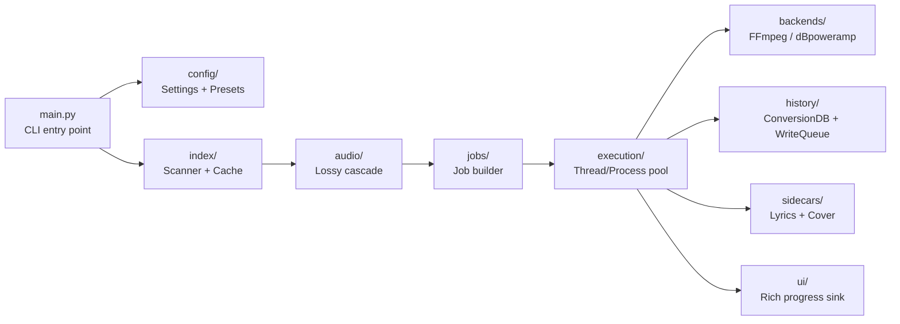
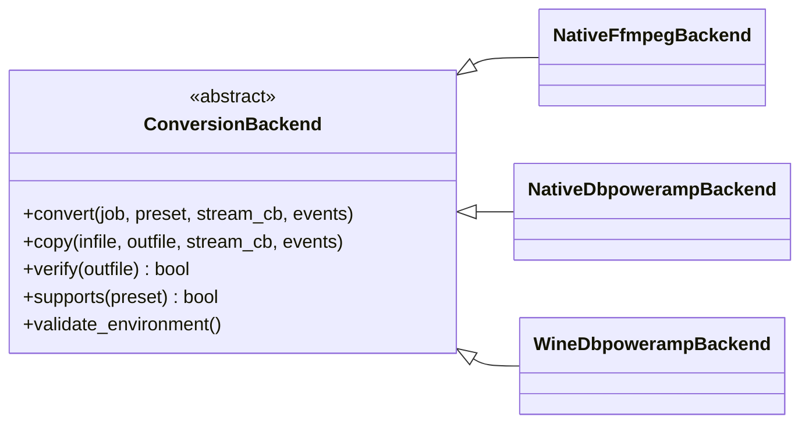

# Architecture

This document describes how dBpoweramp Wrapper is structured internally. It is aimed at developers who want to understand, extend, or debug the tool. End users should start with [README.md](https://github.com/5509346169/wrapper_dbpoweramp/blob/main/README.md) and [docs/index.md](index.md).

---

## High-level system overview

The tool is a pipeline: it scans a directory tree, classifies each file, then converts (or copies) them in parallel. Two SQLite databases and an event queue provide coordination.



---

## Component map

### `main.py`

`main.py` is a ≤ 60-line dispatcher that builds an `AppContext` (see `src/app/context.py`) and hands off to `src/app/commands/{build_index,run_from_index,run_pipeline,dry_run,list_lossy,db_check,db_migrate}.py`. The dispatcher routes based on the parsed `argparse` Namespace:

- `--db-version` flag set → `db_check.run(args)` (prints and exits)
- `args.command == "db"` → `db_check.run(args)` / `db_migrate.run(args)` (subcommand dispatch)
- `--build-index` set → `build_index.run(ctx)`
- `--index` set → `run_from_index.run(ctx)`
- Otherwise → `run_pipeline.run(ctx)`

### `src/config/`

| File | Responsibility |
|------|----------------|
| `models.py` | Typed dataclasses mirroring the `settings.yaml` schema |
| `settings_loader.py` | Parses `settings.yaml` into `Settings` objects; validates required keys |
| `preset_loader.py` | Parses `presets.yaml` into `PresetConfig` objects |

### `src/app/`

Post-refactor application structure. All modules are internal.

| File | Responsibility |
|------|----------------|
| `context.py` | `AppContext` frozen dataclass + `build_context(args)` factory |
| `backend.py` | `_resolve_backend_name()` + `supports()` compatibility gate |
| `lifecycle/signals.py` | `SignalGuard` context manager for SIGINT/SIGTERM |
| `lifecycle/tempdir.py` | `tmp/` directory lifecycle |
| `lifecycle/scan_cache.py` | Scan cache open/close wrapper |
| `pipeline/scan.py` | `scan_with_progress` / `load_rows_from_cache` orchestration |
| `pipeline/enrich.py` | Calls `src/jobs/enrich.py` for lossy probe |
| `pipeline/jobs.py` | `_row_to_job` + lossy-gate check |
| `pipeline/prefilter.py` | `should_skip` loop + pre-verify gate (`--verify-skip`) |
| `pipeline/phases.py` | `_run_jobs_by_phase` (phased execution mode) |
| `pipeline/execute.py` | Verbose/Rich sink + `run_all` loop + futures draining |
| `pipeline/reporting.py` | Final "Done. Success: ..." summary + `_format_bytes` |
| `commands/build_index.py` | `cmd_build_index(ctx)` |
| `commands/run_from_index.py` | `cmd_run_from_index(ctx)` |
| `commands/run_pipeline.py` | Main scan + enrich + execute flow |
| `commands/dry_run.py` | `--dry-run` handling |
| `commands/list_lossy.py` | `--list-lossy` handling |
| `commands/db_check.py` | `db check` / `--db-version` entry point |
| `commands/db_migrate.py` | `db migrate` entry point |

### `src/cli/`

| File | Responsibility |
|------|----------------|
| `args.py` | `parse_args()` — `argparse` parser for all CLI flags. `validate_args()` — cross-flag consistency checks. Also owns the `db` subcommand group. |
| `db_cmd.py` | `cmd_db_check()`, `cmd_db_migrate()`, `cmd_db_doctor()` — dispatchers for the `db` subcommand group. |

### `src/audio/`

Lossy source detection cascade. Each file is evaluated through three tiers in sequence:

| Module | Tier | How it decides |
|--------|------|----------------|
| `extensions.py` | 1 — Extension | Unambiguous extensions (`.mp3`, `.aac`, `.ogg`, `.opus` → lossy; `.flac`, `.wav`, `.wv`, `.ape`, `.tta` → lossless). Returns immediately if the extension is in the known list. |
| `folder_heuristic.py` | 2 — Folder name | Looks for lossy tokens (`mp3`, `aac`, `m4a`, `ogg`, `opus`) in any parent directory name. Handles cases like `~/Music/MP3/track.flac` where the file extension is ambiguous. |
| `mutagen_probe.py` | 3 — Metadata | Reads the audio stream codec tag via `mutagen`. Called only for ambiguous extensions (`.m4a`, `.mp4`, `.wav`) that tier 1 and 2 could not resolve. |
| `integrity.py` | Post-convert verifier | `VerifyStatus` enum, `VerifyResult` dataclass, `verify_file()` dispatcher. Produces `Okay` / `Not - ...` / `Skipped - ...` via `result.short`. |
| `verify_backends.py` | Integrity check implementations | `_verify_soundfile` (libsndfile full-frame decode + FLAC MD5 + truncation guard), `_verify_miniaudio` (streaming decode), `_verify_mutagen` (tag sanity only, last-resort fallback). |

The cascade is implemented in `cascade.py`. Tiers are tried **per file** — not in three sequential phases — so all worker threads stay busy throughout the probe phase regardless of the workload mix.

### `src/index/`

| File | Responsibility |
|------|----------------|
| `scanner.py` | `_discover_audio_files()` — iterative DFS walk using `os.scandir` (avoids double-stat on Windows). `scan_with_progress()` — walks, collects stats and sidecar candidates, optionally populates the scan cache. Returns `IndexRow` objects. |
| `scan_cache.py` | A small per-run SQLite snapshot of the scan results. On repeat runs against the same input+excludes, the scan phase loads from this cache instead of walking the filesystem. |
| `builder.py` | `IndexBuilder` — writes `IndexRow` objects into `tmp/index.db` (the **temp index**), commits, and provides `iter_rows()` and `get_summary()` for consumers. |
| `cleanup.py` | `cleanup_index()` — deletes `tmp/index.db` on clean exit; preserves it on failure or interrupt so it can be inspected with `sqlite3`. Called from the `finally:` block in `main._main()`. |

**Temp index schema** (`tmp/index.db`):

```sql
CREATE TABLE index_entries (
    id           INTEGER PRIMARY KEY AUTOINCREMENT,
    source_path  TEXT NOT NULL,
    dest_path    TEXT NOT NULL,
    job_type     TEXT NOT NULL,
    file_size    INTEGER NOT NULL,
    sidecar_files TEXT NOT NULL,
    mtime        REAL NOT NULL,
    is_lossy     INTEGER,         -- 0 = lossless, 1 = lossy, NULL = not probed
    created_at   TEXT NOT NULL
);
```

### `src/jobs/`

| File | Responsibility |
|------|----------------|
| `classify.py` | `classify()` — for each `IndexRow`, decides `job_type` (`convert`, `copy`, or `skip`) based on lossy status and the user's `--lossy-action`. Also fills in `dest_path` via `compute_output_path`. |
| `enrich.py` | `enrich_index_rows()` and `enrich_index_rows_streaming()` — orchestrate the lossy probe across `probe_workers` threads, streaming results back to the caller so `IndexBuilder` can write rows in real time. |
| `build_jobs.py` | `build_jobs()` — converts enriched `IndexRow` objects into `ConversionJob` namedtuples, applying the resume pre-filter against `conversion_history.db`. |

### `src/backends/`

Abstract base class + three concrete implementations:



- **`base.py`** — `ConversionBackend` ABC. Defines `convert()`, `copy()`, `verify()`, `supports()`, and `validate_environment()`. The `validate_environment()` call is made **fail-fast** at startup (before any file is touched): missing binaries or Wine prefix raise `BackendError` immediately.
- **`registry.py`** — `get_backend()`, `detect_backend_for_run()`, `resolve_backend_for_run()`. Picks the backend using this priority: CLI override (`--backend`) > auto-detect (Windows + dBpoweramp installed + preset supports it) > `backend.default` in `settings.yaml`.
- **`native_ffmpeg.py`** — invokes `ffmpeg` / `flac` / `lame` / `opusenc` directly.
- **`native_dbpoweramp.py`** — invokes `CoreConverter.exe` directly (Windows only).
- **`wine_dbpoweramp.py`** — translates paths via `winepath -w` before invoking `CoreConverter.exe` via `wine`.

### `src/execution/`

| File | Responsibility |
|------|----------------|
| `run_job.py` | `run_job()` — single-job worker. Dispatches to `backend.convert()`, `backend.copy()`, or a no-op for `skip` jobs. Calls `backend.verify()` before marking SUCCESS. Pushes log lines to the event queue. |
| `run_all.py` | `run_all()` — top-level orchestrator. Creates a `ThreadPoolExecutor` or `ProcessPoolExecutor`, submits all jobs, starts the event-drain thread, and returns a summary. |
| `events.py` | `JobEventKind` enum (`LOG`, `STARTED`, `FINISHED`) and helpers `_make_event_queue()`, `_build_stream_callback()`, `_push_log_event()`. |
| `event_drain.py` | `_drain_events_into_ui()` and `_run_event_drain_thread()` — background thread that reads from the event queue and forwards log lines to the progress sink. Runs for the duration of `run_all()` so Rich is never called from a worker thread. |

### `src/history/`

| File | Responsibility |
|------|----------------|
| `schema.py` | Shared `CREATE TABLE` and PRAGMA statements for both the history DB and the scan cache DB. Both use WAL mode and a 5-second busy timeout. |
| `conversion_db.py` | `ConversionDB` — synchronous read/write wrapper around `conversion_history.db`. `should_skip()` checks source+dest+job_type and file size to decide whether to skip a job on resume. `__init__` auto-runs `migrate_to_current()` on first open. `log_conversion` accepts optional `verify_status`, `verify_reason`, `verify_format`, `verify_duration_s` kwargs. |
| `write_queue.py` | `DBWriteQueue` — async writer. Workers push log entries to a `queue.Queue`; a dedicated background thread drains them and writes to the DB. Eliminates concurrent write contention. Callers must call `flush()` before exit. |
| `migrations.py` | Schema versioning and migration orchestration. Owns `SCHEMA_VERSION` (current = 2), `MIGRATIONS` list, `migrate_to_current()`, `get_db_version()`, and `DbVersionInfo` dataclass. Creates `<db>.bak-<UTCISO>` before the first schema change and writes a `migration_audit` row after each step. |

### `src/sidecars/`

| File | Responsibility |
|------|----------------|
| `manager.py` | `SidecarManager` — reads the `sidecars` block from the preset. `_copy_sidecars()` copies lyric files (`.lrc`, `.txt`) and cover art (`.jpg`, `.png`) from each source file's directory to its destination, optionally renaming covers to dot-prefix (`.cover.jpg`) for privacy. |

### `src/ui/`

| File | Responsibility |
|------|----------------|
| `progress_view.py` | `ProgressSink` ABC and three concrete implementations: `RichProgressSink` (live progress bar with byte counter), `VerboseProgressSink` (plain terminal output), `NullProgressSink` (no-op). |
| `progress/protocol.py` | `ProgressSink` protocol definition. |
| `progress/renderer.py` | `RichProgressRenderer` — constructs the Rich `Progress` object with columns: task name, progress bar, file count, byte counter. |
| `progress/rich_sink.py` | `RichProgressSink` implementation. Manages phase transitions (`start_phase`, `stop_phase`, `advance`, `log_file`) and subtask bars for per-file live output. |
| `progress/verbose_sink.py` | `VerboseProgressSink` implementation. Plain `print()` calls with phase headers. |
| `progress/null_sink.py` | `NullProgressSink` — all methods are no-ops. Used in `--verbose` mode when no progress bar is desired. |

---

## Data flow: scan to conversion

```
Input directory
    │
    │  _discover_audio_files()
    │  (os.scandir iterative DFS, excludes matched on dir basename)
    │
    ▼
List[ (Path, size, mtime) ]
    │
    │  scan_with_progress()
    │  (collects sidecar basenames, writes to ScanCache if enabled)
    │
    ▼
List[IndexRow]  ──────► ScanCache (tmp/scan_cache_*.db)
    │                        (reused on next run to skip dir walk)
    │
    │  enrich_index_rows_streaming()
    │  (lossy cascade per file, dest_path, job_type, writes to...)
    │
    ▼
tmp/index.db  (IndexBuilder)
    │
    │  IndexBuilder.iter_rows()
    │  (re-read from SQLite as the single source of truth)
    │
    ▼
List[IndexRow]  ──────► ConversionDB.should_skip()
    │                        (resume pre-filter: checks history + file size)
    │
    ▼
List[ConversionJob]
    │
    │  run_all() → Thread/ProcessPoolExecutor
    │
    ├─► backend.convert()  →  output file
    │                             │
    │        ┌─ Pre-verify gate (--verify-skip) ──► demote corrupt skip → pending_jobs
    │        │
    │        └─ Post-convert verify (--verify-output full) ──► NOT_OK → job marked FAILED
    │                                          └─ OK / UNSUPPORTED ──► history log
    │
    ├─► backend.copy()
    └─► (skip — no-op)

DB version inspection (db check / --db-version) — side-branch from entry point, no file operations
```

---

## Concurrency model

### Thread pool (default)

`worker_model: "thread"` uses a `ThreadPoolExecutor`. All conversion backends (`native_ffmpeg`, `native_dbpoweramp`, `wine_dbpoweramp`) are subprocess-based — they invoke an external binary — so the GIL is not a bottleneck. Threads are appropriate for I/O-bound work.

### Process pool

`worker_model: "process"` uses a `ProcessPoolExecutor`. Required when the Python process must be isolated from the workers, or when the backend is CPU-bound (not the case here, but available for future backends).

### Event queue (never touch Rich from a worker)

Workers cannot call Rich directly (it is not thread-safe from outside the main thread). Instead, each worker pushes `(JobEventKind, payload)` tuples onto a `queue.Queue`. A single background drain thread reads from the queue and forwards log lines to the progress sink. This means every worker thread stays productive — there is no synchronization bottleneck at the UI layer.

### Async history writes

`DBWriteQueue` uses the same producer/queue/consumer pattern: workers push log records, and a dedicated thread writes them to `conversion_history.db`. Without this, concurrent workers writing to the same SQLite file would generate `SQLITE_BUSY` errors. WAL mode + a 5-second busy timeout mitigate this at the DB level, but the queue eliminates contention entirely.

### Probe phase parallelism

The lossy probe runs in a separate thread pool (`probe_workers`, default 16). Each probe thread walks its assigned file through the cascade independently, so a file that needs mutagen (Tier 3) does not stall files that resolved via extension (Tier 1). Results are streamed back to the main thread as they arrive.

---

## Three database files

| Database | Location | When created | When deleted |
|----------|----------|-------------|-------------|
| `tmp/index.db` | `tmp/index.db` | Every run (before lossy gate) | Deleted on clean exit; preserved on failure or interrupt |
| `tmp/scan_cache_*.db` | `tmp/` | On every run that walks the directory | Never (reused on next run against same input+excludes) |
| `conversion_history.db` | From `settings.yaml` (default: project root) | On first conversion | Never |

---

## Backend abstraction

The `ConversionBackend` ABC enforces a clean contract. Each backend:

1. **Validates its environment** at instantiation (`validate_environment()`) — fail-fast, before any file is touched. Missing binaries or Wine prefix raise immediately.
2. **Declares preset compatibility** via `supports(preset)` — checked at startup before any work begins.
3. **Implements `convert()`** and `copy()`** using the same calling convention, so the executor is backend-agnostic.
4. **Implements `verify()`** — checks output file exists and is non-zero size. This guards against silent failures where the external tool exits 0 but produced nothing.

The registry (`registry.py`) owns backend selection logic. It is the only module that knows about all three backends; the rest of the system imports only the ABC.
